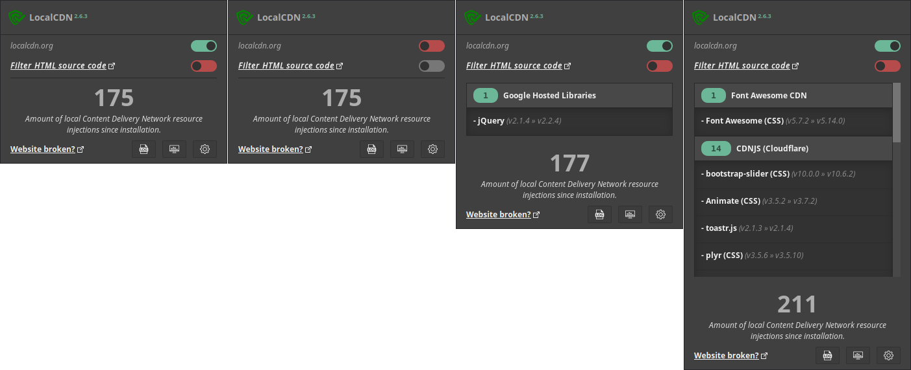
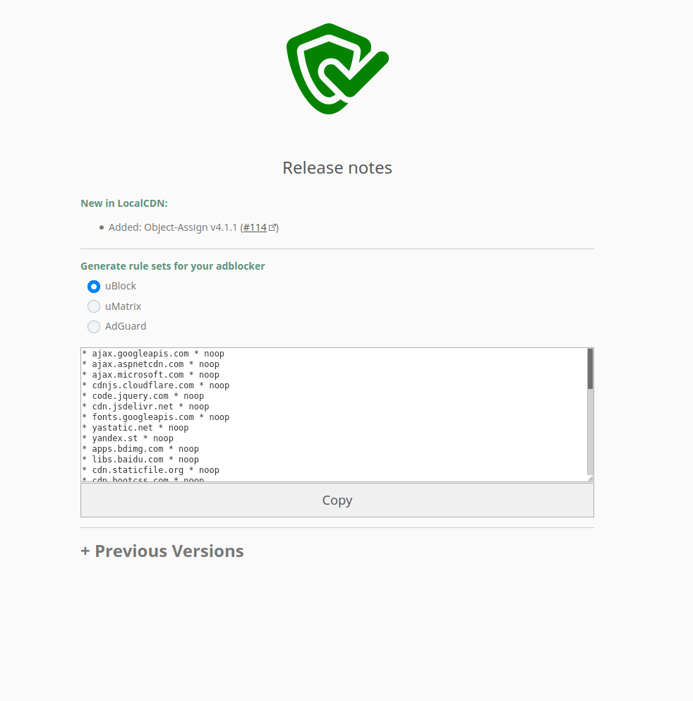
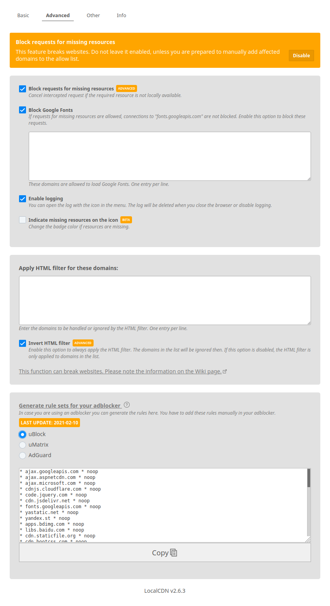
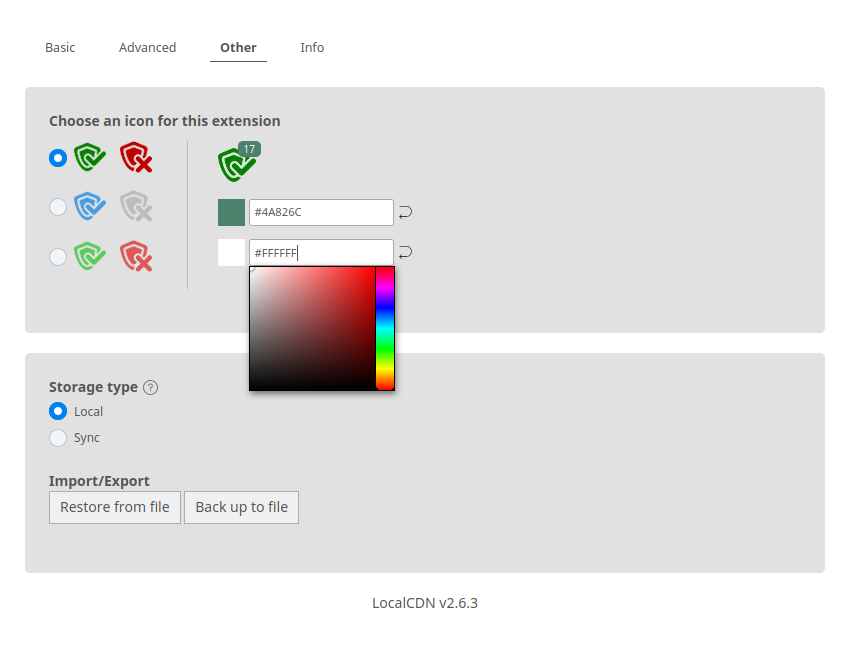

# LocalCDN

    

A web browser extension (and a fork of Decentraleyes) that emulates Content Delivery Networks to improve your online privacy. It intercepts traffic, finds supported resources locally, and injects them into the environment. All of this happens automatically, so no prior configuration is required. Feel free to use the following [testing utility](https://www.localcdn.org/test/) to find out if you are properly protected. For more information, please read the [tutorial](https://www.localcdn.org/tutorial) or the [Wiki](https://codeberg.org/nobody/LocalCDN/wiki). You can also [download](https://addons.mozilla.org/en-US/firefox/addon/localcdn-fork-of-decentraleyes/) the extension directly from Mozilla and just try it.

### What are the advantages?

* Supports cloud storage by browsers sync feature (Firefox Sync or own Sync-Server) if enabled  
* Removes integrity and crossorigin tags from embedded script and style elements to replace even more frameworks 
* Font Awesome  
* Google Material Icons 
* jQuery up to 3.5.1  
* Bootstrap CSS 
* Bootstrap JavaScript  
* AngularJS, AngularJS-Animate, AngularJS-Sanitize, AngularJS-Cookies and AngularJS-Touch  
* React, Vue.js, Chart.js and many other frameworks/libraries  
* MathJax (minimal)  
* Internal statistics about CDNs and frameworks (day, week, month, year)  
* Export/Import your config (day, week, month, year)  
* Prepared rules for uBlock Origin, uMatrix and AdGuard  

> **Note:** LocalCDN is no silver bullet, but it does prevent a lot of websites from making you send these kinds of requests. Ultimately, you can make LocalCDN block requests for any missing CDN resources, too.

#### How does it work?
LocalCDN uses redirection for certain requests. There is a [mapping file](https://codeberg.org/nobody/LocalCDN/src/branch/main/core/mappings.js#L71) that lists the source (all CDNs and the path to the frameworks) and a [resource file](https://codeberg.org/nobody/LocalCDN/src/branch/main/core/resources.js#L328) that defines the destination.

Currently only JavaScript and CSS files are redirected. However, some CSS files internally refer to other files, e.g. Font Awesome. All requests are redirected to a local file, e.g. [jQuery](https://codeberg.org/nobody/LocalCDN/src/branch/main/resources/jquery). This is the reason why the extension is currently 10 MB in size. Only if LocalCDN cannot find a local resource (and the option is enabled), a request will be blocked.

An adblocker (e.g. uBlock Origin, uMatrix or AdGuard) decides which requests are allowed. Only if your adblocker allows a request, it will be intercepted by LocalCDN. LocalCDN catches the request after an adblocker and not before.

## What's the different of LocalCDN in comparison to other CDN emulators?

#### LocalCDN

#### LocalCDN with activated HTML filter (optional)

#### Other CDN emulators

## We need you!

The whole Internet is full of different frameworks and CDNs that negatively affect your privacy. If you find a website that embeds another unsupported version of a framework, please report that website.

#### :warning: **Important** :warning:

In some cases, it isn't possible to use our framework because the website sets up a strong "Same Origin Policy" (SOP). Please read [Broken JavaScript or CSS on some websites](https://codeberg.org/nobody/LocalCDN/wiki/Home#user-content-7-a-website-looks-weird-or-cannot-be-used-if-i-deactivate-localcdn-everything-works-what-is-the-problem) before opening an issue.

On behalf of everyone: Thank you!

## Screenshots

#### Light

#### Dark

#### Rule generator for uBlock Origin, uMatrix and AdGuard (after an update)

#### Settings

#### Internal statistics
 

## Contributing Code

Suggestions in the form of **Issues**, and contributions in the form of **Merge Requests**, are highly welcome.

## Installation

* Mozilla Firefox *(63 or higher)*: [get it on addons.mozilla.org](https://addons.mozilla.org/en-US/firefox/addon/localcdn-fork-of-decentraleyes/)
* Chromium based browser: [Chrome Web Store (by Emanuel Bennici)](https://chrome.google.com/webstore/detail/localcdn-fork-from-decent/njdfdhgcmkocbgbhcioffdbicglldapd) :warning: **Please note this Wiki article [FAQ: Chromium incompatibilities](https://codeberg.org/nobody/LocalCDN/wiki/Home#user-content-2-can-i-use-this-extension-in-my-chrome-browser)** :warning:

#### Running the Code as temporary extension

Please read this [guide](https://codeberg.org/nobody/LocalCDN/wiki/Home#user-content-5-you-recently-changed-something-in-the-code-and-i-would-like-to-test-it-how-do-you-do-that) to run the extension from source.

> **Important:** All tagged commits are signed with GPG. It's likely best to ignore unsigned commits, unless you really know what you're doing. Please send an email if you have any questions or security concerns.

## Contact

Just open an issue with your question or write an [email](https://www.localcdn.org/contact/) (PGP possible!).

## Submitting Translations
The language you want is not completely translated or you are a language talent? Please help us by translating this add-on on [Weblate](https://hosted.weblate.org/projects/localcdn/).

## Donations

LocalCDN is free and open-source. If you like LocalCDN you can support continued development by making a donation. Any help would be greatly appreciated!

* IBAN: `DE22 5003 1000 1069 4660 16` (BIC: `TRODDEF1XXX`)
* Bitcoin: `1C4GRNyuUFkp9dMDjUkV4TwDwdfxdgLzde`
* Ether: `0x2df49c1186f8b615c2059f29c3ed7f9f86d49552`
* Monero: `46j26ggSZNT9rN7VeFYXp2PsKEMyJSSYneBVKXY4xeemdfZfCpNg6tQEXQZpWiTTuGX3SbnDPwuh3167cCoYSrqN72H9jPk`

## License

[MPL-2.0](https://www.mozilla.org/MPL/2.0).

#### External libraries

* Color Picker (Taufik Nurrohman, https://github.com/taufik-nurrohman/color-picker, MIT License)
